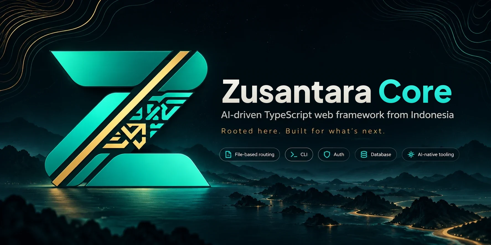

<p align="center"></p>

# Zusantara Core

<p align="center">
  <a href="https://www.npmjs.com/package/zusantara"></a>
  <a href="https://github.com/melkimahdali/zusantara-core/actions/workflows/ci.yml"></a>
  <a href="LICENSE"></a>
  <a href="https://zusantara.morixa.id/"></a>
</p>

[English](#english) · **Bahasa Indonesia**

Framework web TypeScript **AI-driven asal Nusantara**. Tulis apa yang Anda mau dalam bahasa sehari-hari, lalu Zusantara AI yang mengerjakan langkah teknisnya, dengan persetujuan Anda dan selalu diverifikasi dengan test. Zusantara framework umum: bangun blog, sistem booking, dasbor internal, API, atau aplikasi apa pun.

```bash
npm install -g zusantara   # sekali saja, lalu cukup ketik: zusantara
zusantara                  # buat proyek baru, atur AI (OmniRoute gratis), lalu chat dengan Zusantara AI
❯ buatkan halaman jadwal booking untuk user yang login
```

Fitur utama:
- **Routing berbasis file** dan validasi input (zod/valibot/arktype).
- **Keamanan bawaan:** session terenkripsi, CSRF, CORS, dan rate limit.
- **Database** Drizzle ORM: SQLite tanpa instalasi, atau PostgreSQL.
- **Auth** dengan scrypt dan role, plus **halaman bawaan** login, daftar, dasbor, dan admin dari kit UI `zusantara/ui`.
- **Zusantara AI** di terminal (CLI interaktif gaya Claude Code berbasis Ink) dan di browser: halaman sambutan dan halaman error bisa langsung diajak chat untuk membangun fitur atau memperbaiki error.
- **Halaman error lengkap** saat pengembangan: stack trace dengan potongan kode, detail request, tombol "Tanya Zusantara AI".
- **Back-end:** job latar belakang dengan coba ulang dan jadwal cron, email SMTP, unggah file yang aman, dan cache.
- **Dua bahasa:** CLI, Zusantara AI, halaman bawaan, kit UI, template, dan dokumentasi dalam Bahasa Indonesia dan Bahasa Inggris.
- Provider AI: **OmniRoute (default, gratis)**, Claude, OpenAI, Gemini, Groq, DeepSeek, OpenRouter, Ollama, dengan fallback otomatis bila kredit habis.

> **Dulu bernama Zentara.** Sejak 0.12.10 paketnya `zusantara` dan `create-zusantara`. Proyek lama cukup menjalankan `npx zusantara@latest migrate:zusantara` lalu `npm install` ([panduan](https://zusantara.morixa.id/cli.html#pindah-dari-zentara)).

## Dokumentasi

📖 **https://zusantara.morixa.id/** (English: **https://zusantara.morixa.id/en/**): mulai cepat, Zusantara AI & OmniRoute, routing, database, auth, referensi CLI. Sumbernya ada di [`docs/`](docs) dan [`docs/en/`](docs/en) (Markdown); pratinjau lokal: `npm run build && npm run docs:build && npm run docs:serve`.

## Peta jalan

Zusantara dikembangkan per tahap. Tahap 10 (Bahasa Inggris) dan 11 (Back-End) dirilis di 0.12; berikutnya **Tahap 12: chat Zusantara AI di semua halaman** (0.12.5), lalu kit UI untuk AI (0.12.6) dan panel admin (0.13) sampai 1.0 di Tahap 19. Rincian semua tahap ada di [docs/peta-jalan.md](docs/peta-jalan.md) dan https://zusantara.morixa.id/peta-jalan.html.

## Brand

Logo, favicon, versi terminal (ANSI/ASCII), dan pedoman warna ada di [`assets/brand`](assets/brand). Warna utama: Zusantara Teal `#2ED3B7`, Heritage Gold `#C89B52`, Core Obsidian `#0D1719`, Pearl White `#F2F4F0`, Muted Slate `#829490`. Aset kecil yang dipakai framework dibuat dari master logo dengan `scripts/brand/generate.py`. Banner README ada di `assets/zusantara-banner.webp`; gambar pratinjau sosial (1280×640) di `assets/brand/social/social-preview.jpg`.

Nama dan logo Zusantara adalah merek; aturan pemakaiannya ada di [TRADEMARKS.md](TRADEMARKS.md). Kontribusi mengikuti [CONTRIBUTING.md](CONTRIBUTING.md) dan [kode etik](CODE_OF_CONDUCT.md).

## Paket di repo ini

| Paket | Keterangan |
|---|---|
| [`packages/zusantara`](packages/zusantara) | framework + CLI `zusantara` (README paket npm) |
| [`packages/create-zusantara`](packages/create-zusantara) | `npm create zusantara` beserta template `api` dan `minimal` |

## Pengembangan framework

```bash
npm install          # memasang workspace
npm run build        # build kedua paket
npm test             # test kedua paket
npm run e2e          # simulasi publish: npm pack, buat proyek dari tarball, install, test, jalankan server,
                     # CLI global (npm install -g), tool Zusantara AI, dan alur interaktif buat proyek
```

- Spesifikasi kontrak inti: [`CORE_SPEC.md`](CORE_SPEC.md).
- Cara merilis ke npm: [`PUBLISHING.md`](PUBLISHING.md).
- Riwayat perubahan: [`CHANGELOG.md`](CHANGELOG.md).

Lisensi [Business Source License 1.1](LICENSE) (BSL). Boleh dipakai gratis untuk membangun dan menjalankan aplikasi Anda sendiri, termasuk untuk produksi dan komersial; yang dilarang adalah menawarkan Zusantara Core (atau turunannya) sebagai framework, generator proyek, atau layanan pesaing. Setiap versi otomatis menjadi Apache 2.0 empat tahun setelah terbit. Versi 0.8.6 ke bawah tetap MIT.

## English

Zusantara Core is an **AI-driven TypeScript web framework from Indonesia**. Describe what you want in plain language and Zusantara AI handles the technical steps, with your approval and always verified by tests. It is general-purpose: build a blog, a booking system, an internal dashboard, an API, or anything else.

```bash
npm install -g zusantara   # once, then just type: zusantara
zusantara lang en          # use Zusantara in English
zusantara                  # create a project, set up AI (free OmniRoute), then chat with Zusantara AI
❯ build a booking schedule page for signed-in users
```

File-based routing, validation, encrypted sessions, CSRF/CORS, Drizzle ORM (SQLite or PostgreSQL), auth with roles, a UI kit with ready-made pages, background jobs and cron, email, file uploads, cache, and Zusantara AI in the terminal and the browser. Documentation: **https://zusantara.morixa.id/en/**.

> **Formerly Zentara.** Since 0.12.10 the packages are `zusantara` and `create-zusantara`. Move an existing project with `npx zusantara@latest migrate:zusantara`, then `npm install` ([guide](https://zusantara.morixa.id/en/cli.html#moving-from-zentara)).

The Zusantara name and logo are trademarks; see [TRADEMARKS.md](TRADEMARKS.md). Contributions follow [CONTRIBUTING.md](CONTRIBUTING.md) and the [code of conduct](CODE_OF_CONDUCT.md).
