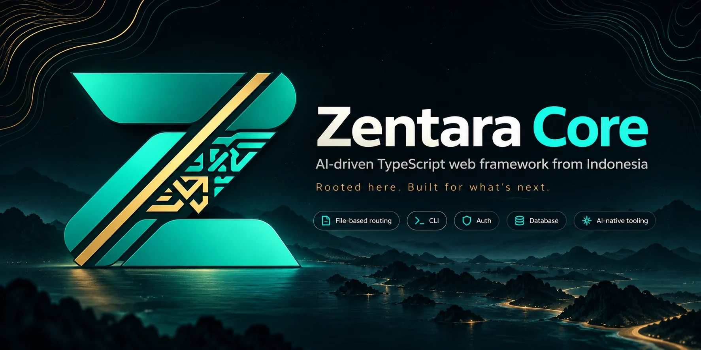

<p align="center"></p>

# Zentara Core

Framework web TypeScript **AI-driven asal Nusantara**. Tulis apa yang Anda mau dalam bahasa sehari-hari, lalu Zentara AI yang mengerjakan langkah teknisnya, dengan persetujuan Anda dan selalu diverifikasi dengan test.

```bash
npm install -g zentara   # sekali saja, lalu cukup ketik: zentara
zentara                  # buat proyek baru, atur AI (OmniRoute gratis), lalu chat dengan Zentara AI
❯ tambahkan fitur keranjang belanja untuk user yang login
```

Fitur utama:
- **Routing berbasis file** dan validasi input (zod/valibot/arktype).
- **Keamanan bawaan:** session terenkripsi, CSRF, CORS, dan rate limit.
- **Database** Drizzle ORM: SQLite tanpa instalasi, atau PostgreSQL.
- **Auth** dengan scrypt dan role.
- **Zentara AI** di terminal (CLI interaktif gaya Claude Code) dan di browser: halaman sambutan dan halaman error bisa langsung diajak chat untuk membangun fitur atau memperbaiki error.
- **Halaman error lengkap** saat pengembangan: stack trace dengan potongan kode, detail request, tombol "Tanya Zentara AI".
- Provider AI: **OmniRoute (default, gratis)**, Claude, OpenAI, Gemini, Groq, DeepSeek, OpenRouter, Ollama, dengan fallback otomatis bila kredit habis.

## Dokumentasi

📖 **https://melkimahdali.github.io/zentara-core/**: mulai cepat, Zentara AI & OmniRoute, routing, database, auth, referensi CLI. Sumbernya ada di [`docs/`](docs) (Markdown); pratinjau lokal: `npm run build && npm run docs:build && npm run docs:serve`.

## Brand

Logo, favicon, versi terminal (ANSI/ASCII), dan pedoman warna ada di [`assets/brand`](assets/brand). Warna utama: Zentara Teal `#2ED3B7`, Heritage Gold `#C89B52`, Core Obsidian `#0D1719`, Pearl White `#F2F4F0`, Muted Slate `#829490`. Aset kecil yang dipakai framework dibuat dari master logo dengan `scripts/brand/generate.py`. Banner README ada di `assets/zentara-banner.webp`; gambar pratinjau sosial (1280×640) di `assets/brand/social/social-preview.jpg`.

## Paket di repo ini

| Paket | Keterangan |
|---|---|
| [`packages/zentara`](packages/zentara) | framework + CLI `zentara` (README paket npm) |
| [`packages/create-zentara`](packages/create-zentara) | `npm create zentara` beserta template `api` dan `minimal` |

## Pengembangan framework

```bash
npm install          # memasang workspace
npm run build        # build kedua paket
npm test             # test kedua paket
npm run e2e          # simulasi publish: npm pack, buat proyek dari tarball, install, test, jalankan server
```

- Spesifikasi kontrak inti: [`CORE_SPEC.md`](CORE_SPEC.md).
- Cara merilis ke npm: [`PUBLISHING.md`](PUBLISHING.md).
- Riwayat perubahan: [`CHANGELOG.md`](CHANGELOG.md).

Lisensi [MIT](LICENSE).
